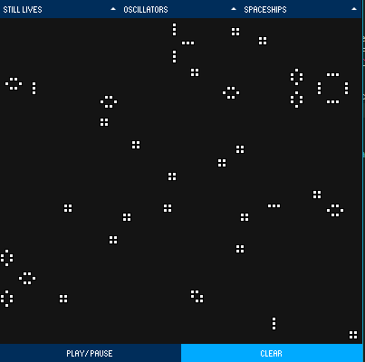

# Game of Life on Processing

An implementation of the game of life using Processing.

Basic usage controls:

 * Press the mouse to change the state of a cell
 * Use the mouse wheel to change the framerate of the simulation
 * Choose one of the pre-made structures and spawn them into the simulation
 * Play/Pause simulation
 * Clear the simulation for an empty canvas

Learn more [here](https://en.wikipedia.org/wiki/Conway%27s_Game_of_Life).